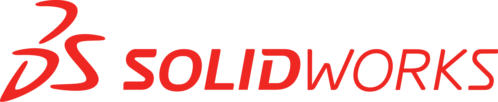
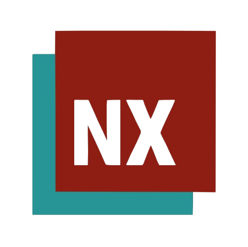
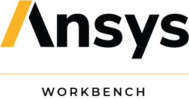
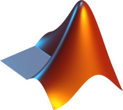
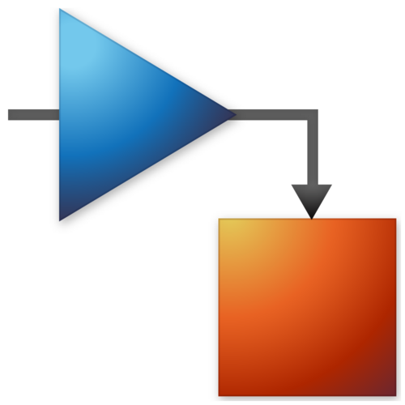
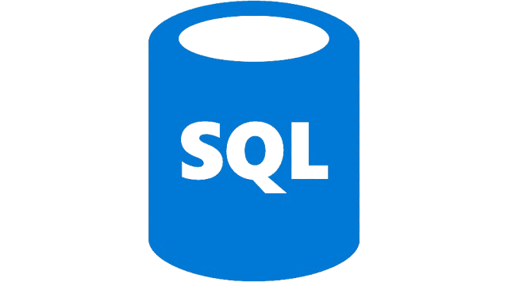
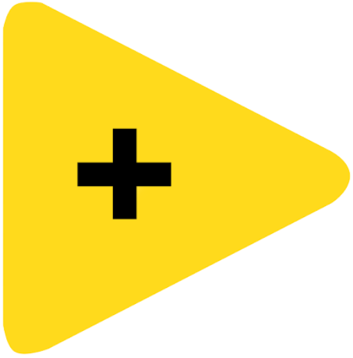

# Abhi Maddula

[LinkedIn](https://www.linkedin.com/in/abhimaddula) | [Resume](resume.pdf)

I recently graduated with a B.S. in Aerospace Engineering (Minor in Mechanical Engineering) with a focus on rocket propulsion systems. I’m passionate about rocket engines' complexity, power, and the challenge of understanding how tightly coupled physics, from fluid flow to combustion to hardware integration, come together in real systems.

I interned at Bell Flight, where I performed engine integration and structural load analyses on the MV-75 program, and at GKN Aerospace, where I developed Python-based manufacturing analytics tools, LabVIEW DAQ systems, and Siemens NX redesigns for production hardware and test equipment.

I also have hands-on rocket propulsion experience through UTA AeroMavs on the experimental propulsion sub-team, where I worked on liquid nitrous oxide feed systems, injector design, and cold-flow/hydrostatic testing using real experimental data.

Outside of industry, I have served as Engineering Mentorship Director for AIAA at UTA, leading a 100+ student mentorship program focused on career development and internship placement.

 

## Skills

### CAD & Mechanical Design

  

    
    SolidWorks
  

  

    
    Siemens NX
  

### Engineering Analysis

  

    
    Ansys
  

  

    
    MATLAB
  

  

    
    Simulink
  

### Programming & Data Acquisition

  

    
    Python
  

  

    
    SQL
  

  

    
    LabVIEW
  

 

## Professional Experience & Technical Projects
* [Aerospace Engineering Intern — Bell Flight](bell-flight.md)
* [Mechanical Engineering Intern — GKN Aerospace](gkn-aerospace.md)
* [Mechanical Design Lead — Hybrid Rocket Engine Feed Manifold](hybrid-rocket.md)
